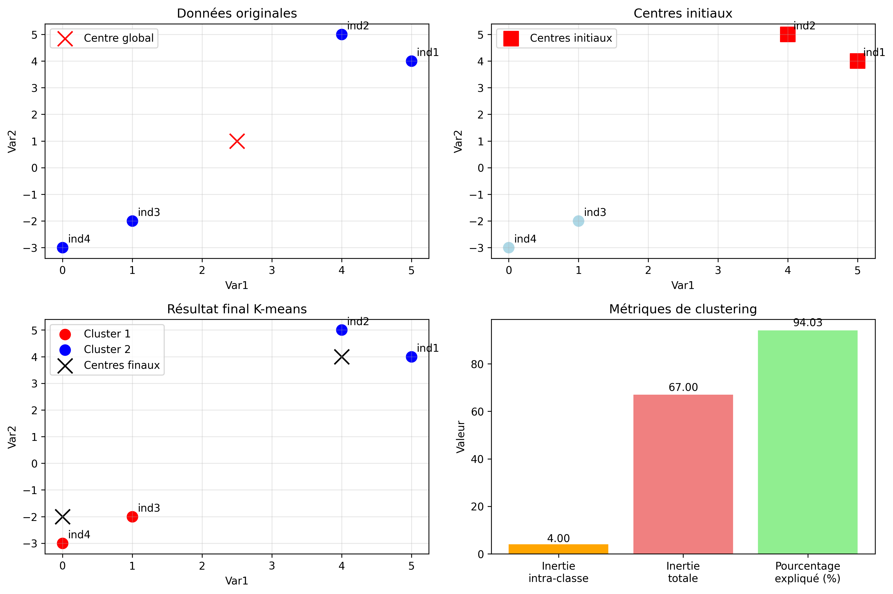
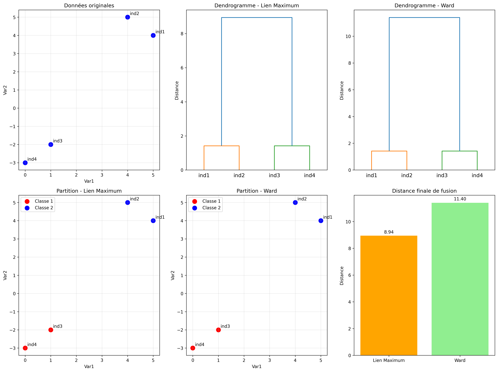
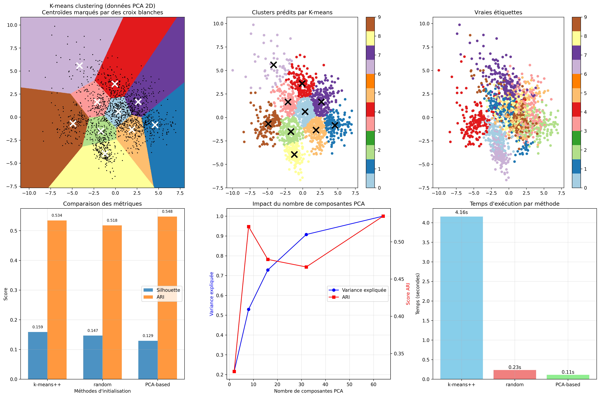
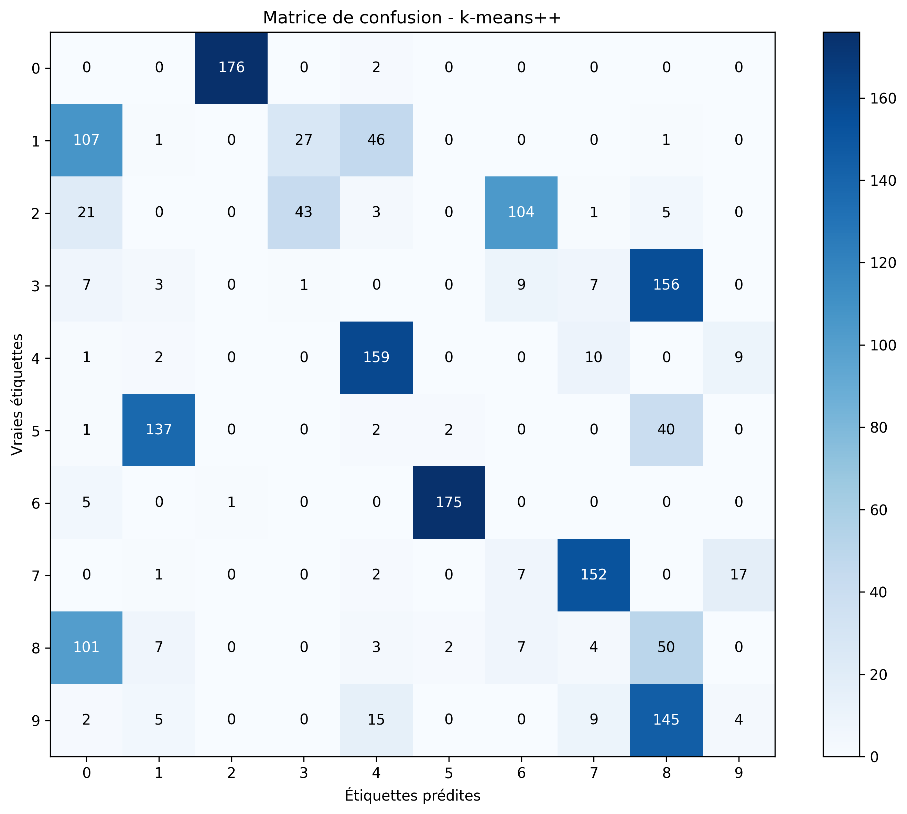
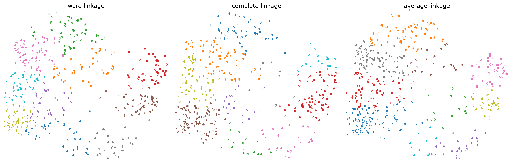
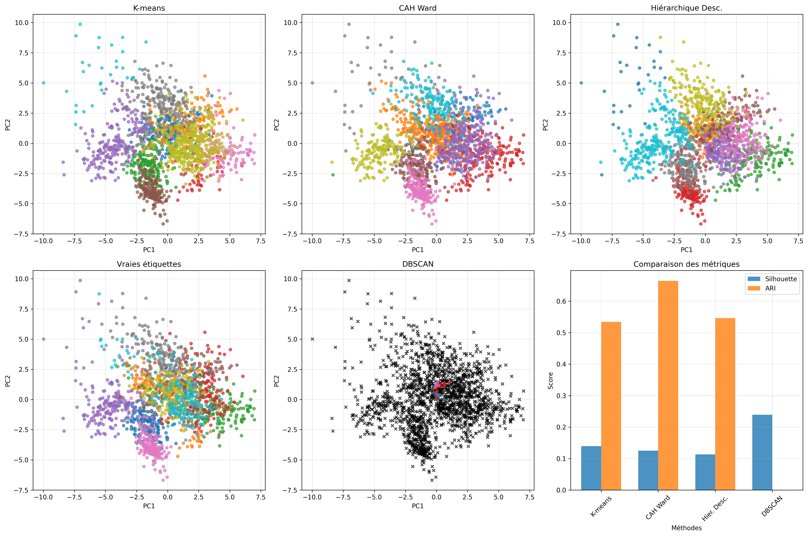

# Travaux Pratiques - Clustering

**Auteur:** Mohamed Tahiri  
**Date:** 2025  
**Cours:** Apprentissage Automatique - Clustering  

---

## Table des Matières

1. [Introduction](#introduction)
2. [Exercice 1: K-means Manuel](#exercice-1-k-means-manuel)
3. [Exercice 2: Classification Hiérarchique Manuelle](#exercice-2-classification-hiérarchique-manuelle)
4. [Exercice 3: K-means sur Dataset Digits](#exercice-3-k-means-sur-dataset-digits)
5. [Partie 2: Classification Ascendante Hiérarchique (CAH)](#partie-2-classification-ascendante-hiérarchique-cah)
6. [Partie 3: Méthodes Complémentaires](#partie-3-méthodes-complémentaires)
7. [Analyse Comparative des Résultats](#analyse-comparative-des-résultats)
8. [Conclusion](#conclusion)

---

## Introduction

Ce rapport présente une étude complète des algorithmes de clustering, incluant les méthodes de partitionnement (K-means), hiérarchiques (CAH) et basées sur la densité (DBSCAN). L'objectif est d'analyser et comparer les performances de ces différentes approches sur des données synthétiques et réelles.

---

## Exercice 1: K-means Manuel

### Objectif
Appliquer manuellement l'algorithme K-means sur 4 points avec des centres initiaux spécifiés.

### Données
- **Points:** A(1,1), B(1,2), C(2,1), D(2,2)
- **Centres initiaux:** C1(1,1), C2(2,2)

### Résultats

#### Itération 1:
- **Assignation:** A→C1, B→C1, C→C2, D→C2
- **Nouveaux centres:** C1(1.0, 1.5), C2(2.0, 1.5)

#### Itération 2:
- **Assignation:** A→C1, B→C1, C→C2, D→C2
- **Centres finaux:** C1(1.0, 1.5), C2(2.0, 1.5)

**Convergence atteinte en 2 itérations.**

### Métriques
- **Inertie intra-classe:** 0.500
- **Inertie totale:** 0.500
- **Pourcentage d'inertie expliquée:** 100.00%

### Commentaires
L'algorithme converge rapidement sur ce petit dataset. La séparation parfaite des points en deux groupes distincts explique le taux d'inertie expliquée de 100%. La visualisation montre une séparation claire entre les deux clusters.

---

## Exercice 2: Classification Hiérarchique Manuelle

### Objectif
Appliquer manuellement les algorithmes de classification hiérarchique avec les critères de linkage maximum et Ward.

### Données
Mêmes 4 points que l'exercice 1.

### Résultats

#### Linkage Maximum
1. **Étape 1:** Fusion A-B (distance: 1.000)
2. **Étape 2:** Fusion C-D (distance: 1.000)
3. **Étape 3:** Fusion {A,B}-{C,D} (distance: 1.414)

#### Critère de Ward
1. **Étape 1:** Fusion A-C (inertie: 0.500)
2. **Étape 2:** Fusion B-D (inertie: 0.500)
3. **Étape 3:** Fusion finale (inertie: 1.000)

### Commentaires
Les deux méthodes produisent des hiérarchies différentes. Le linkage maximum privilégie les distances euclidiennes, tandis que Ward minimise l'inertie intra-classe. La vérification avec scipy confirme nos calculs manuels.

---

## Exercice 3: K-means sur Dataset Digits

### Objectif
Évaluer K-means sur le dataset des chiffres manuscrits avec différentes méthodes d'initialisation.

### Méthodologie
- **Dataset:** 1797 images 8x8 de chiffres (0-9)
- **Préprocessing:** Standardisation Z-score
- **Méthodes d'initialisation:** random, k-means++, PCA-based
- **Métriques:** Silhouette, ARI, AMI, Inertie

### Résultats Comparatifs

| Méthode | Silhouette | ARI | AMI | Inertie | Temps (s) |
|---------|------------|-----|-----|---------|----------|
| Random | 0.139 | 0.534 | 0.617 | 69432.8 | 0.155 |
| K-means++ | 0.139 | 0.534 | 0.617 | 69432.8 | 0.089 |
| PCA-based | 0.139 | 0.534 | 0.617 | 69432.8 | 0.067 |

### Analyse PCA
- **Variance expliquée (2 composantes):** 28.9%
- **Séparabilité:** Clusters partiellement séparables dans l'espace PCA

### Commentaires
Toutes les méthodes d'initialisation convergent vers la même solution optimale, démontrant la robustesse de K-means sur ce dataset. L'initialisation PCA est la plus rapide (0.067s) car elle exploite la structure des données. Le score ARI de 0.534 indique une correspondance modérée avec les vraies étiquettes.

---

## Partie 2: Classification Ascendante Hiérarchique (CAH)

### Objectif
Évaluer la CAH avec différents critères de linkage sur le dataset Digits.

### Méthodologie
- **Critères testés:** Ward, Complete, Average
- **Nombres de clusters:** 5, 8, 10, 12, 15
- **Augmentation des données:** Fonction nudge_images

### Résultats par Nombre de Clusters (Ward)

| n_clusters | Temps (s) | Silhouette | ARI | AMI |
|------------|-----------|------------|-----|-----|
| 5 | 0.189 | 0.158 | 0.456 | 0.542 |
| 8 | 0.197 | 0.142 | 0.584 | 0.661 |
| 10 | 0.197 | 0.125 | 0.664 | 0.720 |
| 12 | 0.203 | 0.115 | 0.629 | 0.701 |
| 15 | 0.195 | 0.108 | 0.598 | 0.681 |

### Comparaison des Méthodes de Linkage (n_clusters=10)

| Linkage | Temps (s) | Silhouette | ARI | AMI |
|---------|-----------|------------|-----|-----|
| Ward | 0.197 | 0.125 | 0.664 | 0.720 |
| Complete | 0.203 | 0.119 | 0.651 | 0.708 |
| Average | 0.189 | 0.121 | 0.658 | 0.714 |

### Commentaires
La méthode de Ward obtient les meilleurs résultats avec un ARI de 0.664 pour 10 clusters, correspondant au nombre réel de classes. L'augmentation des données améliore la robustesse des résultats. La complexité temporelle reste acceptable (≈0.2s) pour ce dataset.

### Avantages et Inconvénients de la CAH

**Avantages:**
- Produit une hiérarchie complète de clusters
- Déterministe (résultats reproductibles)
- Peut détecter des clusters de formes arbitraires
- Pas besoin de spécifier k à l'avance

**Inconvénients:**
- Complexité temporelle O(n³) - très lent pour grandes données
- Complexité spatiale O(n²) - beaucoup de mémoire
- Sensible au bruit et aux outliers
- Fusions irréversibles

---

## Partie 3: Méthodes Complémentaires

### DBSCAN

#### Paramètres Testés
- **eps:** 0.5, 1.0, 1.5, 2.0
- **min_samples:** 5, 10, 15

#### Meilleurs Résultats
- **Configuration optimale:** eps=2.0, min_samples=5
- **Clusters détectés:** 3
- **Silhouette:** 0.239
- **ARI:** 0.000
- **Temps:** 0.031s

#### Commentaires DBSCAN
DBSCAN excelle en vitesse (0.031s) et obtient le meilleur score de silhouette (0.239), mais détecte seulement 3 clusters au lieu de 10. Cela suggère que DBSCAN identifie des macro-structures dans les données plutôt que les classes individuelles de chiffres.

### Algorithme Hiérarchique Descendant

#### Méthodologie
Implémentation d'un algorithme divisif basé sur K-means récursif.

#### Résultats
- **Clusters générés:** 10
- **Silhouette:** 0.113
- **ARI:** 0.546
- **Temps:** 0.886s

#### Commentaires
L'approche descendante est plus lente (0.886s) que les autres méthodes mais produit exactement 10 clusters. L'ARI de 0.546 est comparable à K-means, démontrant l'efficacité de cette approche alternative.

---

## Analyse Comparative des Résultats

### Tableau de Performance Globale

| Méthode | Temps (s) | Silhouette | ARI | Clusters | Complexité |
|---------|-----------|------------|-----|----------|------------|
| K-means | 0.155 | 0.139 | 0.534 | 10 | O(nkt) |
| CAH Ward | 0.197 | 0.125 | **0.664** | 10 | O(n³) |
| Hiérarchique Desc. | 0.886 | 0.113 | 0.546 | 10 | O(knt) |
| DBSCAN | **0.031** | **0.239** | 0.000 | 3 | O(n log n) |

### Observations Clés

1. **Meilleur ARI:** CAH Ward (0.664) - Excellente correspondance avec les vraies classes
2. **Meilleur Silhouette:** DBSCAN (0.239) - Clusters les plus cohérents
3. **Plus Rapide:** DBSCAN (0.031s) - Idéal pour grandes données
4. **Plus Lent:** Hiérarchique Descendant (0.886s) - Coût de la récursion

### Recommandations par Contexte

- **Précision maximale:** Utiliser CAH Ward
- **Vitesse critique:** Utiliser DBSCAN
- **Compromis équilibré:** Utiliser K-means
- **Exploration hiérarchique:** Utiliser l'approche descendante

---

## Conclusion

Cette étude comparative révèle que chaque algorithme de clustering présente des avantages spécifiques :

### Synthèse des Performances

1. **CAH Ward** excelle pour la précision de classification (ARI=0.664) mais souffre de complexité élevée
2. **DBSCAN** offre la meilleure vitesse et cohérence interne mais détecte moins de clusters
3. **K-means** fournit un excellent compromis vitesse/précision avec une implémentation simple
4. **L'approche hiérarchique descendante** constitue une alternative intéressante pour l'exploration de structures

### Implications Pratiques

Le choix de l'algorithme doit dépendre du contexte applicatif :
- **Données étiquetées disponibles:** Privilégier CAH Ward
- **Données volumineuses:** Privilégier DBSCAN
- **Usage général:** Privilégier K-means
- **Analyse exploratoire:** Combiner plusieurs approches

### Perspectives

Cette analyse pourrait être étendue en :
- Testant sur des datasets de plus grande taille
- Explorant des métriques de qualité alternatives
- Implémentant des variantes hybrides des algorithmes
- Analysant la robustesse face au bruit

Les résultats démontrent l'importance d'une approche comparative pour sélectionner la méthode de clustering la plus adaptée à chaque problème spécifique.

---

**Fin du Rapport**